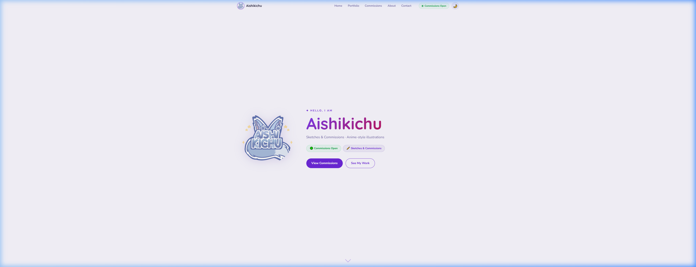
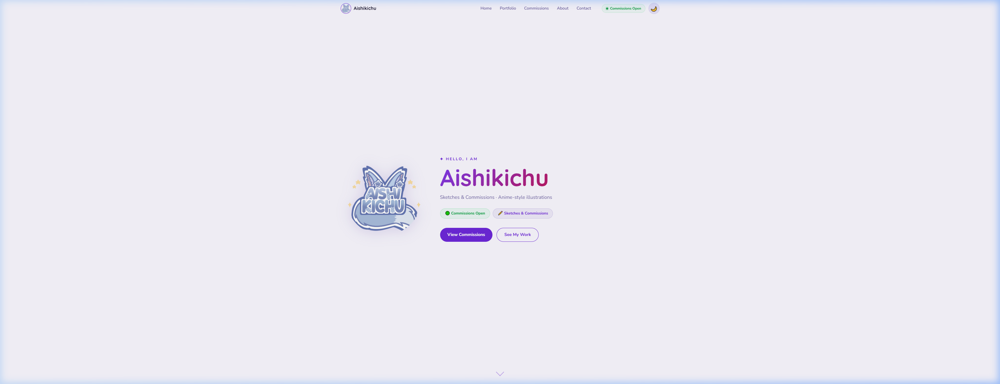
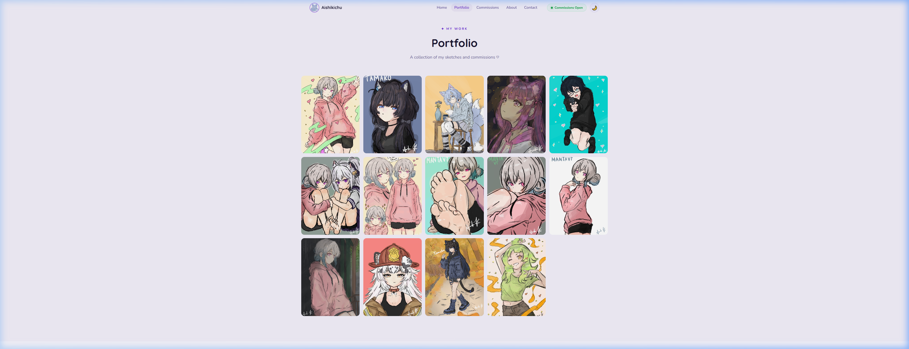
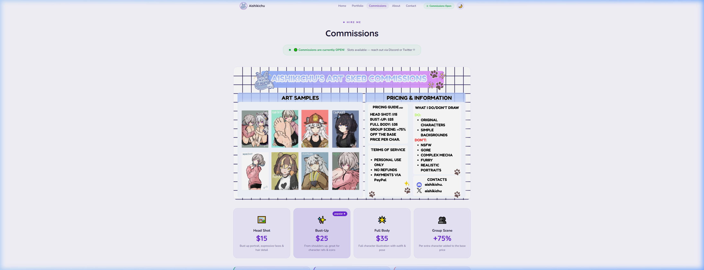
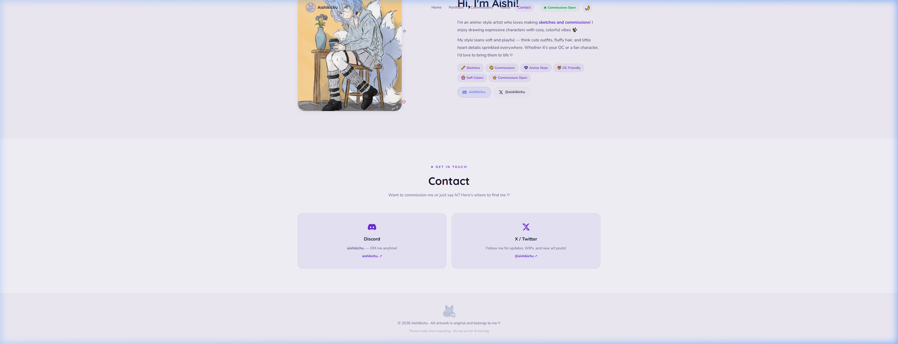
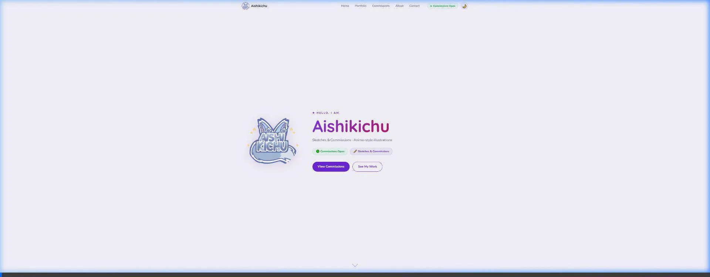

# Aishikichu — Art Portfolio & Commissions

> Personal art portfolio website for **Aishikichu** — an anime-style artist specialising in sketches and character commissions. Features a constellation background animation, light/dark mode, a loading screen, and a full gallery with lightbox viewer.

<div align="center">

[](https://x.com/aishikichu)
[](https://x.com/aishikichu)
[](LICENSE)

</div>

---

## ✨ Preview

### Dark Mode


### Light Mode


### Gallery


### Commissions


### Contact


### 🌌 Constellation Animation


---

## 🎨 Features

| Feature | Details |
|---|---|
| 🌙 Dark / ☀️ Light Mode | Toggle in the navbar, saved to `localStorage` |
| 🌌 Constellation Canvas | Subtle animated star network with mouse parallax |
| 💜 Loading Screen | Logo splash on first load |
| 🖼️ Gallery + Lightbox | Full-screen image viewer with keyboard nav |
| 📱 Responsive | Works on mobile, tablet, and desktop |
| ✨ Scroll Reveal | Elements fade in as you scroll |
| 🟢 Commission Status | Easy open/closed toggle |

---

## 🗂️ Project Structure

```
Aishi Art Portfolio/
├── index.html          # Main page (all sections)
├── style.css           # All styles + dark/light tokens
├── script.js           # Constellation, theme toggle, lightbox, gallery
├── Images/             # All artwork and assets
│   ├── 111aishikichu.png   # Logo / avatar
│   ├── Commsheet aishi.png # Commission sheet
│   └── *.png / *.jpg       # Portfolio artworks
└── .github/
    └── screenshots/    # README preview images
```

---

## 🖼️ Adding New Art

Open [`script.js`](script.js) and find the `galleryImages` array near the top. Add your image as a new line:

```js
const galleryImages = [
  // ... existing entries ...
  { src: 'Images/your-new-art.png', alt: 'Description of the piece' },  // ← add here
];
```

Then add the matching HTML block in [`index.html`](index.html) inside `<div class="gallery-grid">`:

```html
<div class="gallery-item">
  <div class="gallery-img-wrap">
    
    <div class="gallery-overlay">
      <button class="gallery-zoom" onclick="openLightbox(N)" aria-label="View full">🔍</button>
    </div>
  </div>
</div>
```

> Replace `N` with the next index number (0-based, so if you have 16 items, the new one is `16`).

---

## 🟢 Toggling Commissions Open / Closed

At the very top of [`script.js`](script.js), find and flip this one value:

```js
const COMMISSIONS_OPEN = true;   // ← change to false to close
```

This automatically updates the status banner, the nav pill, and the commission button.

> **Note:** This feature is planned — see open tasks below.

---

## 🛠️ Running Locally

No build step needed — it's plain HTML/CSS/JS.

Just open `index.html` in your browser, or use a simple local server:

```bash
# Python (if installed)
python -m http.server 8080

# Then open: http://localhost:8080
```

---

## 📬 Contact & Commissions

| Platform | Link |
|---|---|
| 🐦 Twitter / X | [@aishikichu](https://x.com/aishikichu) |
| 💬 Discord | `aishikichu.` |

---

## 📄 License

This project is licensed under the **Creative Commons Attribution-NonCommercial 4.0 International (CC BY-NC 4.0)** license.

See [`LICENSE`](LICENSE) for the full text.

**In short:**
- ✅ You may view and reference the code for personal/educational use
- ✅ You must credit **Aishikichu** if you share or adapt it
- ❌ You may **not** use this commercially
- ❌ You may **not** use the artwork for AI training or redistribution

> All artwork in the `Images/` folder is **© 2026 Aishikichu** — all rights reserved. The artwork is not covered by the CC license and may not be reproduced, used, or redistributed without explicit permission.
